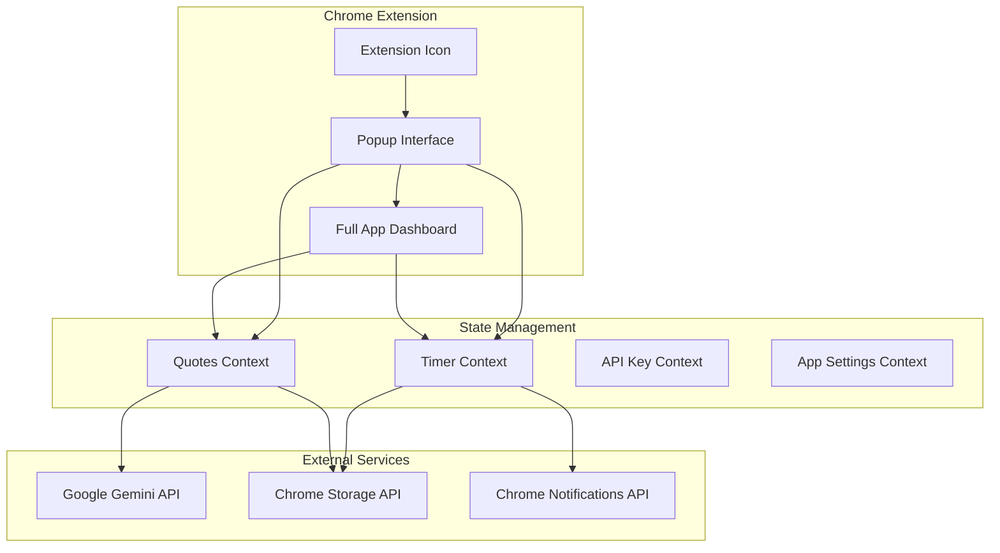

# Design Document

## Overview

Focus & Smile 3.0 represents a comprehensive architectural redesign that transforms the existing Chrome extension from a basic timer into a sophisticated productivity platform. The design maintains the core timer functionality while introducing a cohesive design system, enhanced user experience, and expanded functionality through AI-powered features, comprehensive quote management, and detailed progress tracking.

The architecture follows a dual-interface approach: a streamlined popup for quick access and a full dashboard for comprehensive productivity management. Both interfaces share state management and maintain session continuity through Chrome's storage API.

## Architecture

### High-Level Architecture



### Component Architecture

The application follows a provider-based architecture using React Context for state management:

1. **App Mode Provider**: Determines whether to render popup or full app interface
2. **Timer Provider**: Manages timer state, session progression, and notifications
3. **Quotes Provider**: Handles quote collection, AI generation, and user interactions
4. **API Key Provider**: Manages Gemini API authentication and validation
5. **App Settings Provider**: Handles user preferences and configuration

### Design System Foundation

The design system is built on Material 3 principles with a custom color palette and typography system:

- **Primary Colors**: Google Blue (#4285F4) for focus sessions
- **Secondary Colors**: Google Green (#34A853) for breaks
- **Tertiary Colors**: Deep Purple (#7E57C2) for long breaks
- **Typography**: Google Sans for headings, Roboto for body text
- **Components**: Material 3 cards, buttons, and interactive elements

## Components and Interfaces

### Chrome Extension Popup (PopupView)

**Purpose**: Provide quick access to timer functionality with minimal friction

**Key Components**:
- **Enhanced Header**: Logo (32x32px), session counter with NumberTicker animation, API settings access
- **Circular Timer Display**: Central progress ring with digital time display, color-coded by session type
- **Control Interface**: Large FAB for play/pause, secondary buttons for reset/skip
- **Navigation Bridge**: Prominent "Open Full App" button with quick access to specific sections
- **Background Effects**: Subtle DotPattern for visual depth

**State Management**:
- Consumes TimerContext for timer operations
- Integrates with ApiKeyContext for settings access
- Uses enhanced components with Magic UI effects

### Full App Dashboard (FullAppView)

**Purpose**: Comprehensive productivity management interface

**Architecture**:
- **Persistent Header**: Logo (40x40px), app branding, API settings, dark mode toggle
- **Tab-Based Navigation**: Timer, Quotes, Stats sections with hash-based routing
- **Responsive Layout**: Container-based design with maximum width constraints

**Navigation System**:
- Hash-based routing (`#timer`, `#quotes`, `#recap`)
- URL synchronization with tab state
- No full page reloads for internal navigation

### Timer Section Enhancement

**Enhanced Timer Display**:
- Larger circular progress indicator for immersive experience
- Session-contextual quote display using AI-powered selection
- Material 3 card design for quote presentation
- Integration with existing timer controls

**AI Quote Integration**:
- Contextual quote selection based on session type
- Fallback system for offline/API unavailable scenarios
- Quote rating and feedback system

### Quotes Collection Interface

**Management Features**:
- **Filter System**: Material 3 chips for category filtering (All, Favorites, Productivity, etc.)
- **Search Functionality**: Real-time search with text matching
- **Grid Layout**: Responsive card grid with hover-revealed actions
- **Bulk Operations**: Multi-select with bulk delete/export functionality

**AI Generation**:
- Floating Action Button for AI quote generation
- Modal interface for vibe/theme selection
- Integration with Gemini API for contextual content

**Quote Card Design**:
- Material 3 card with elevation and hover effects
- Action buttons revealed on hover (Favorite, Edit, Delete)
- Rating system for user feedback
- Category badges and source indicators

### Stats and Progress Tracking

**Metrics Display**:
- **Stat Cards**: Total focus time, sessions completed, favorite quote
- **Progress Visualization**: Weekly bar chart using chart library
- **Achievement Badges**: Visual indicators for milestones

**AI Recap Generation**:
- Dedicated card with clear call-to-action
- "Generate Shareable Recap" button
- Integration with Imagen API for visual recap creation
- Export functionality for social sharing

## Data Models

### Enhanced Timer State

```typescript
interface TimerState {
  remainingSec: number;
  sessionType: SessionType;
  sessionCount: number;
  dailyStats?: {
    completedSessions: number;
    totalFocusTime: number;
    lastSessionDate: string;
  };
}

interface TimerSettings {
  durations: SessionDurations;
  soundUrl: string;
  notifications: boolean;
  autoStartBreaks: boolean;
  theme: 'light' | 'dark' | 'auto';
}
```

### Quote Management System

```typescript
interface Quote {
  id: number;
  text: string;
  author: string;
  isFavorite: boolean;
  category?: string;
  source: 'curated' | 'ai-generated' | 'user' | 'favorite';
  rating?: number;
  tags?: string[];
  createdAt: number;
  lastUsed?: number;
}

interface QuoteFilter {
  category?: string;
  source?: string;
  isFavorite?: boolean;
  searchTerm?: string;
  tags?: string[];
}
```

### AI Integration Models

```typescript
interface AIQuoteRequest {
  vibe: string;
  sessionType?: SessionType;
  count: number;
  previousQuotes?: Quote[];
}

interface RecapGenerationRequest {
  stats: RecapStats;
  timeframe: 'daily' | 'weekly' | 'monthly';
  includeQuote: boolean;
  style: 'minimal' | 'detailed' | 'artistic';
}
```

## Error Handling

### API Error Management

**Gemini API Errors**:
- Rate limiting: Implement exponential backoff with user feedback
- Authentication errors: Clear messaging with settings redirect
- Network errors: Graceful degradation with cached content
- Quota exceeded: Alternative content suggestions

**Chrome Extension Errors**:
- Storage API failures: Local fallback with sync retry
- Notification permission: Graceful degradation with in-app alerts
- Tab creation errors: Fallback to window.open for full app access

### User Experience Error Handling

**Progressive Enhancement**:
- Core timer functionality works without API key
- Quote display falls back to curated content
- Offline mode with cached quotes and basic functionality

**Error State Design**:
- Material 3 alert components for error messaging
- Contextual help and recovery suggestions
- Non-blocking error states that don't interrupt workflow

## Testing Strategy

### Unit Testing

**Component Testing**:
- Timer logic and state transitions
- Quote filtering and search functionality
- AI service integration with mocked responses
- Storage synchronization and data persistence

**Hook Testing**:
- Timer provider state management
- Quote provider CRUD operations
- API key validation and error handling
- Cross-component state synchronization

### Integration Testing

**Chrome Extension Integration**:
- Popup to full app navigation
- Storage API synchronization
- Notification system functionality
- Tab management and window handling

**AI Service Integration**:
- Gemini API authentication and requests
- Image generation and processing
- Error handling and fallback scenarios
- Rate limiting and quota management

### User Experience Testing

**Cross-Interface Testing**:
- State persistence between popup and full app
- Timer continuity during navigation
- Settings synchronization across interfaces
- Performance impact of Magic UI components

**Accessibility Testing**:
- Keyboard navigation support
- Screen reader compatibility
- Color contrast compliance
- Focus management in modals and navigation

### Performance Testing

**Extension Performance**:
- Popup load time optimization
- Memory usage monitoring
- Background script efficiency
- Storage operation performance

**Full App Performance**:
- Initial load time measurement
- Navigation transition smoothness
- AI request response times
- Large quote collection handling

## Implementation Considerations

### Chrome Extension Constraints

**Content Security Policy**:
- Inline styles and scripts restrictions
- External resource loading limitations
- API endpoint whitelisting requirements

**Storage Limitations**:
- Chrome storage quota management
- Data synchronization across devices
- Backup and recovery strategies

### AI Integration Considerations

**API Key Management**:
- Secure storage in Chrome extension storage
- Validation and testing mechanisms
- User-friendly setup and configuration

**Content Generation**:
- Appropriate content filtering
- Context-aware generation parameters
- Caching strategies for generated content

### Performance Optimization

**Bundle Size Management**:
- Code splitting for popup vs full app
- Lazy loading of AI features
- Efficient asset loading strategies

**State Management Optimization**:
- Selective context updates
- Memoization of expensive computations
- Efficient storage synchronization

### Accessibility and Usability

**Design System Compliance**:
- Material 3 accessibility guidelines
- Consistent interaction patterns
- Clear visual hierarchy and feedback

**User Onboarding**:
- Progressive feature discovery
- Contextual help and tooltips
- Smooth transition from basic to advanced features